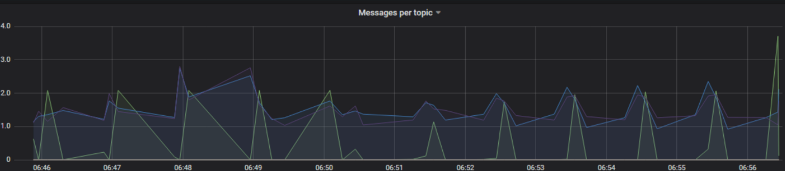
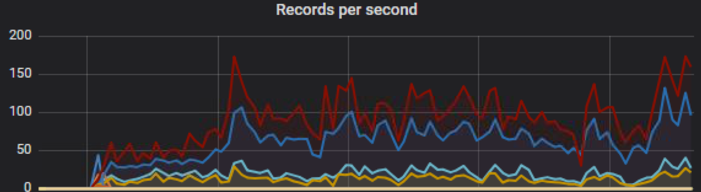

# Documents on monitoring kafka on kubernetes

#### Exposing metrics and creation of grafana plugin 

```
refer kafka_deployment.yaml
configure JMX_PORT  set to 9000 
```
adding liveliness probe 
```
livenessProbe:
  exec:
    command: ["/bin/sh", "-c", "exec netstat -n | grep -q :8086"]
```

Please see screenshot taken from my previous experiance 



Records per second metrics 



